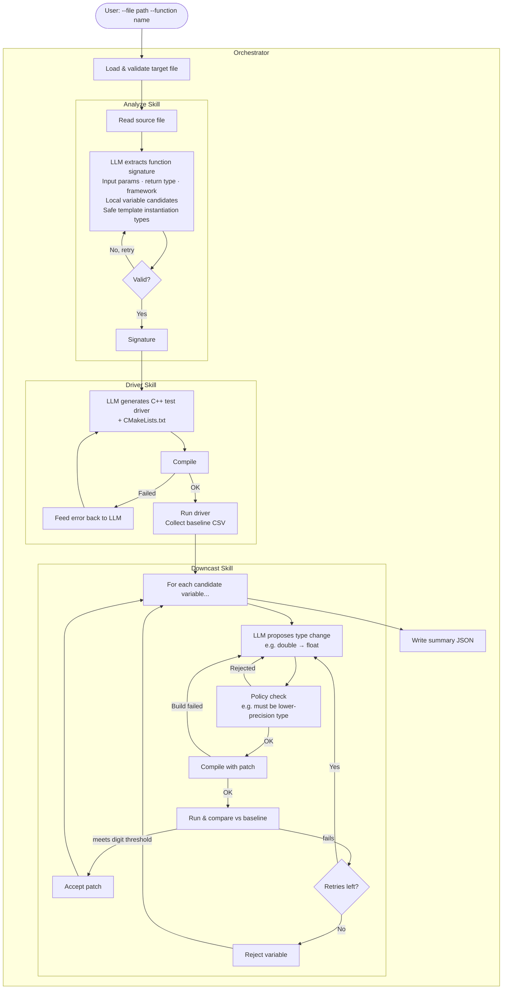

# Agentic Mixed-Precision Demo

An LLM-powered agent that automatically finds safe **mixed-precision optimizations** in C++ scientific computing functions. Given any C++ function, the agent identifies which local variables can be safely downcast from `double` to `float` without losing numerical accuracy beyond a configurable threshold.

No manual configuration is required — the agent reads the source file directly, reasons about the function, and verifies each proposed change numerically.

---

## What it does

High-performance computing code is often written in `double` precision throughout for safety. In practice, many intermediate variables tolerate `float` precision without affecting the final result. Finding these variables manually is tedious and error-prone. This project automates that search:

1. **Analyze** the target function to understand its signature and identify candidate local variables.
2. **Generate** a test driver that calls the function with random inputs and records outputs.
3. **Propose** a downcast for each candidate variable (e.g. change `double x` to `float x`).
4. **Verify** numerically: compile with the patch, run it, and compare output against the double-precision baseline. Accept if the result agrees to at least N decimal digits; reject otherwise.

---

## Agentic workflow

The system is built as a set of **LangGraph** subgraphs (skills), each handling one stage of the pipeline. An orchestrator graph wires them together.



### Skills

| Skill | Responsibility |
|-------|---------------|
| **Analyze** | Reads the full source file. Uses an LLM to extract the function signature (parameters, return type, portability framework), infer safe input domains for random testing, identify local floating-point variables as downcast candidates, and determine concrete template instantiation types that avoid compiler overload ambiguity. |
| **Driver** | Uses an LLM to generate a complete, self-contained C++ test driver and its `CMakeLists.txt`. Handles the detected portability framework (Kokkos, SYCL, OpenMP, CUDA, HIP, or plain C++). Feeds compilation errors back to the LLM and retries until the driver compiles and runs successfully, producing a baseline CSV of outputs. |
| **Downcast** | Iterates over each candidate local variable. For each one, asks an LLM to propose a source-level type change to a lower-precision type (e.g. `float`). Compiles the patched source, runs it with the same random inputs as the baseline, and compares outputs digit-by-digit. Accepts the patch if it meets the precision threshold, rejects it otherwise, and feeds verification results back to the LLM for the next attempt. |

---

## Repository layout

```
.
├── run-argo.sh                  # Entry point (handles tunnel + proxy + runs the agent)
├── src/                         # Example target: kokkosUtils.h (Kokkos C++ library)
├── scripts/
│   ├── compare_results.py       # Numerical comparison tool (baseline vs candidate CSV)
│   └── prepare.sh               # Loads build environment modules
├── llm_agent/
│   ├── run.py                   # CLI entry point (called by run-argo.sh)
│   ├── config.py                # Model name, iteration limits
│   ├── client.py                # Anthropic API client factory
│   ├── state.py                 # TypedDicts for all graph states
│   ├── graphs/
│   │   └── orchestrator.py      # Top-level LangGraph graph
│   ├── skills/
│   │   ├── analyze/             # Signature extraction subgraph
│   │   ├── driver/              # Driver generation + compile-iterate subgraph
│   │   └── downcast/            # Patch proposal + verification subgraph
│   └── tools/
│       ├── build.py             # compile_driver(), run_driver(), build_and_run()
│       └── compare.py           # Wrapper around scripts/compare_results.py
└── experiments/                 # Output: baseline CSVs, candidate CSVs, summary JSONs
```

---

## Prerequisites

**Build environment:**
- C++17 compiler
- CMake ≥ 3.16
- The portability framework used by your target (e.g. Kokkos, OpenMP). For the included example (`kokkosUtils.h`) Kokkos must be on `CMAKE_PREFIX_PATH`.
- `scripts/prepare.sh` must set up the build environment (module loads, paths).

**Python:**
- Python 3.12
- Install dependencies: `pip install -r requirements-argo-agent.txt`

**LLM access (Argonne JLSE):**
The agent uses the Anthropic API routed through the Argo proxy on JLSE. `run-argo.sh` handles this automatically — it detects whether the SSH tunnel and proxy are already running (e.g. from an existing Claude Code session) and reuses them.

If running outside JLSE, set `ANTHROPIC_API_KEY` and omit `--base-url` from `llm_agent/run.py`, or point `ANTHROPIC_BASE_URL` at your own proxy.

---

## Usage

```bash
./run-argo.sh --file <repo-relative-path-to-header> \
              --function <function-name> \
              [--skills downcast] \
              [--min-digits 10] \
              [--batch 10] \
              [--seed 123] \
              [--max-iterations 3] \
              [--max-driver-retries 5] \
              [--output-dir experiments/]
```

**Example** — optimize `ddilog` from the included Kokkos utility header:

```bash
./run-argo.sh --file src/kokkosUtils.h --function ddilog --skills downcast --min-digits 10 --batch 10
```

**Output** — a JSON summary printed to stdout and written under `experiments/<function>/generated/`:

```json
{
  "function": "ddilog",
  "framework": "kokkos",
  "accepted_variables": ["S"],
  "rejected_variables": ["T", "Y", "H", "ALFA", "B1", "B2", "B0"],
  "accepted_patches": [
    {
      "file_path": "src/kokkosUtils.h",
      "old_line": "        TMass S;",
      "new_line": "        float S;",
      "reasoning": "..."
    }
  ]
}
```

### Key options

| Option | Default | Description |
|--------|---------|-------------|
| `--file` | required | Repo-relative path to the C++ header containing the target function |
| `--function` | required | Name of the function to optimize |
| `--skills` | `downcast` | Optimization skills to run |
| `--min-digits` | `10` | Minimum precise decimal digits required to accept a downcast |
| `--batch` | `10` | Number of random input samples per run |
| `--seed` | `123` | RNG seed (use the same seed across all runs for reproducibility) |
| `--max-iterations` | `3` | Max LLM retry attempts per variable in the downcast skill |
| `--max-driver-retries` | `5` | Max compile-fix attempts in the driver skill |

---

## How verification works

The agent uses **bitwise-reproducible** output comparison. For each run:

1. The driver generates `batch` random inputs using a fixed seed.
2. Outputs are serialized to CSV.
3. `scripts/compare_results.py` computes the minimum number of matching significant decimal digits across all samples (`min_precise_digits`).
4. A patch is accepted only if `min_precise_digits ≥ --min-digits` for all samples.

This makes accept/reject decisions deterministic and independent of platform floating-point rounding modes.

---

## Adding a new target

No catalog or spec file is needed. Just point the agent at any C++ header and function name:

```bash
./run-argo.sh --file path/to/mylib.h --function my_compute_function --skills downcast --min-digits 10 --batch 20
```

The analyze skill will automatically detect the portability framework, infer input domains from parameter names and types, and identify local variable candidates. The driver skill will generate and compile an appropriate test driver for the detected framework.
