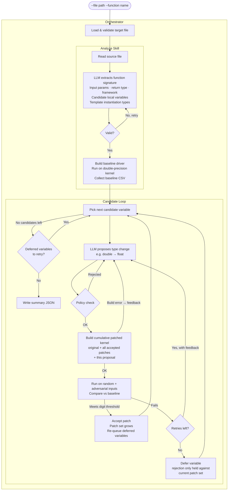

# Agentic Mixed-Precision Demo

An LLM-powered agent that automatically finds safe **mixed-precision optimisations** in C++ scientific computing functions. Given any C++ function, the agent identifies which local variables can be safely downcast from `double` to `float` without losing numerical accuracy beyond a configurable threshold.

No manual configuration is required — the agent reads the source file directly, reasons about the function, and verifies each proposed change numerically against a double-precision baseline.

---

## What it does

High-performance computing code is often written in `double` precision throughout for safety. In practice, many intermediate variables tolerate `float` precision without affecting the final result. Finding these variables manually is tedious and error-prone. This project automates that search:

1. **Analyze** the target function: extract its signature, identify local floating-point variables as downcast candidates, and infer safe input domains.
2. **Build a baseline**: compile the original function into a test driver and run it on a mixed batch of random and adversarial inputs, recording double-precision outputs.
3. **Propose** a downcast for each candidate variable (e.g. `TMass x` → `float x`).
4. **Verify cumulatively**: rebuild the kernel with *all accepted patches plus the new proposal*, run it on the same inputs, and compare against the baseline. Accept if every output agrees to at least N decimal digits; defer or reject otherwise.
5. **Re-queue deferred** variables when the accepted patch set grows — a rejection only holds against the patch set at the time of testing.

---

## Agentic workflow

The system is built as a set of **LangGraph** subgraphs, wired together by an orchestrator that owns the candidate queue and the cumulative patch set.


```mermaid
flowchart TD
    Start([--file path --function name]) --> Load

    subgraph Orchestrator
        Load[Load & validate target file] --> Analyze

        subgraph AnalyzeSkill["Analyze Skill"]
            Analyze[Read source file] --> Extract[LLM extracts function signature\nInput params · return type · framework\nCandidate local variables\nTemplate instantiation types]
            Extract --> Valid{Valid?}
            Valid -- No, retry --> Extract
            Valid -- Yes --> Baseline
        end

        Baseline[Build baseline driver\nRun on double-precision kernel\nCollect baseline CSV] --> Pick

        subgraph Loop["Candidate Loop"]
            Pick[Pick next candidate variable] -- No candidates left --> Requeue
            Requeue{Deferred variables\nto retry?} -- Yes --> Pick
            Requeue -- No --> Summary

            Pick --> Propose[LLM proposes type change\ne.g. double → float]
            Propose --> Policy{Policy check}
            Policy -- Rejected --> Propose
            Policy -- OK --> Build[Build cumulative patched kernel\noriginal + all accepted patches\n+ this proposal]
            Build -- Build error → feedback --> Propose
            Build -- OK --> Verify[Run on random + adversarial inputs\nCompare vs baseline]
            Verify -- Meets digit threshold --> Accept[Accept patch\nPatch set grows\nRe-queue deferred variables]
            Accept --> Pick
            Verify -- Fails --> Retry{Retries left?}
            Retry -- Yes, with feedback --> Propose
            Retry -- No --> Defer[Defer variable\nrejection only held against\ncurrent patch set]
            Defer --> Pick
        end

        Summary[Write summary JSON]
    end
```

### Skills

| Skill | Responsibility |
|-------|---------------|
| **Analyze** | Reads the full source file. Uses an LLM to extract the function signature (parameters, return type, portability framework), infer safe input domains for random testing, identify local floating-point variables as downcast candidates, and determine concrete template instantiation types that avoid compiler overload ambiguity. |
| **Downcast** | Pure proposer: given the current variable, the accumulated patch context, and any previous feedback, produces a single source-level type-change proposal. The orchestrator owns the retry loop, the cumulative patch application, and the accept/defer/requeue logic. |

---

## Repository layout

```
.
├── run-argo.sh                  # Entry point (handles tunnel + proxy + runs the agent)
├── src/                         # Example target: kokkosUtils.h (Kokkos C++ library)
├── scripts/
│   ├── compare_results.py       # Numerical comparison tool (baseline vs candidate CSV)
│   ├── prepare.sh               # Loads build environment modules
│   └── setup_argo_proxy.sh      # Starts the Argo SSH tunnel + proxy
├── llm_agent/
│   ├── run.py                   # CLI entry point
│   ├── config.py                # Model name, iteration limits
│   ├── client.py                # Anthropic API client factory
│   ├── state.py                 # TypedDicts for all graph states
│   ├── graphs/
│   │   └── orchestrator.py      # Top-level LangGraph graph
│   ├── skills/
│   │   ├── analyze/             # Signature extraction subgraph
│   │   ├── downcast/            # Patch proposal subgraph (pure proposer)
│   │   └── driver/              # LLM-generated driver (reference; not wired into graph)
│   └── tools/
│       ├── build.py             # render_driver_source(), build_and_run(), apply_patches()
│       ├── compare.py           # Wrapper around scripts/compare_results.py
│       └── spec_revise.py       # build_and_run_with_revision() — template-type fix loop
└── experiments/                 # Output: baseline CSVs, candidate CSVs, summary JSONs
```

---

## Prerequisites

**Build environment:**
- C++17 compiler
- CMake ≥ 3.16
- The portability framework used by your target (e.g. Kokkos, OpenMP). For the included example (`kokkosUtils.h`), Kokkos must be on `CMAKE_PREFIX_PATH`.
- `scripts/prepare.sh` must set up the build environment (module loads, paths).

**Python:**
- Python 3.12
- Install dependencies: `pip install -r requirements-argo-agent.txt`

**LLM access (Argonne JLSE):**
The agent uses the Anthropic API routed through the Argo proxy on JLSE. `run-argo.sh` handles this automatically — it detects whether the SSH tunnel and proxy are already running and reuses them.

If running outside JLSE, set `ANTHROPIC_API_KEY` and omit `--base-url`, or point `ANTHROPIC_BASE_URL` at your own proxy.

---

## Usage

```bash
./run-argo.sh --file <repo-relative-path-to-header> \
              --function <function-name> \
              [--skills downcast] \
              [--min-digits 10] \
              [--batch 10] \
              [--seed 123] \
              [--max-iterations 3] \
              [--max-requeue-cycles 2] \
              [--output-dir experiments/] \
              [--clean]
```

**Example** — optimise `ddilog` from the included Kokkos utility header:

```bash
./run-argo.sh --file src/kokkosUtils.h --function ddilog --min-digits 10 --batch 10
```

**Output** — a JSON summary written to `experiments/<function>/generated/<function>_summary_<timestamp>.json`:

```json
{
  "function_name": "ddilog",
  "file_path": "src/kokkosUtils.h",
  "framework": "kokkos",
  "error": null,
  "final_patch_set": [
    {
      "file_path": "src/kokkosUtils.h",
      "old_line": "        TMass S;",
      "new_line": "        float S;",
      "reasoning": "S only ever holds ±1.0, exactly representable in float..."
    }
  ],
  "accepted_variables": ["S"],
  "deferred_variables": [],
  "rejected_variables": ["T", "H", "ALFA"],
  "requeue_cycles_used": 2,
  "trace": "... (per-attempt records: proposal, policy_reject, verify_pass, min_precise_digits, outcome)"
}
```

### Key options

| Option | Default | Description |
|--------|---------|-------------|
| `--file` | required | Repo-relative path to the C++ header containing the target function |
| `--function` | required | Name of the function to optimise |
| `--skills` | `downcast` | Optimisation skills to apply |
| `--min-digits` | `10` | Minimum precise decimal digits required to accept a patch |
| `--batch` | `10` | Total input samples per run (first 4 are adversarial; remainder are random) |
| `--seed` | `123` | RNG seed for the random portion of each run |
| `--max-iterations` | `3` | Max LLM proposal attempts per variable before deferring |
| `--max-requeue-cycles` | `2` | Max full re-queue passes for deferred variables |
| `--max-driver-retries` | `5` | Max template-type revision attempts if the baseline build fails |
| `--clean` | off | Delete the output directory before running |

---

## How verification works

Every verification run uses **bitwise-reproducible** output comparison.

**Input sampling** — each batch combines fixed adversarial slots and random samples:

| Slot | Input value |
|------|-------------|
| 0 | Value nearest zero within the domain (cancellation trigger) |
| 1 | Domain maximum |
| 2 | Domain minimum |
| 3 | Domain midpoint |
| 4 … batch−1 | Uniform random samples from the domain (seeded by `--seed`) |

Both the baseline and every candidate run use the same driver template, so adversarial coverage is automatic and comparisons are always valid.

**Precision metric** — `scripts/compare_results.py` computes the minimum number of matching significant decimal digits across all samples and output columns (`min_precise_digits`). A patch is accepted only if `min_precise_digits ≥ --min-digits`.

**Cumulative verification** — the candidate kernel is always rebuilt as `original source + all accepted patches + the new proposal`. A patch that passes in isolation can still break the combined result (errors do not compose linearly), and one that fails in isolation may pass once other patches have been accepted. Deferred variables are re-queued whenever the accepted patch set grows.

---

## Adding a new target

No catalog or spec file is needed. Point the agent at any C++ header and function name:

```bash
./run-argo.sh --file path/to/mylib.h --function my_compute_function --min-digits 10 --batch 20
```

The Analyze skill will automatically detect the portability framework, infer input domains from parameter names and types, and identify local variable candidates.
