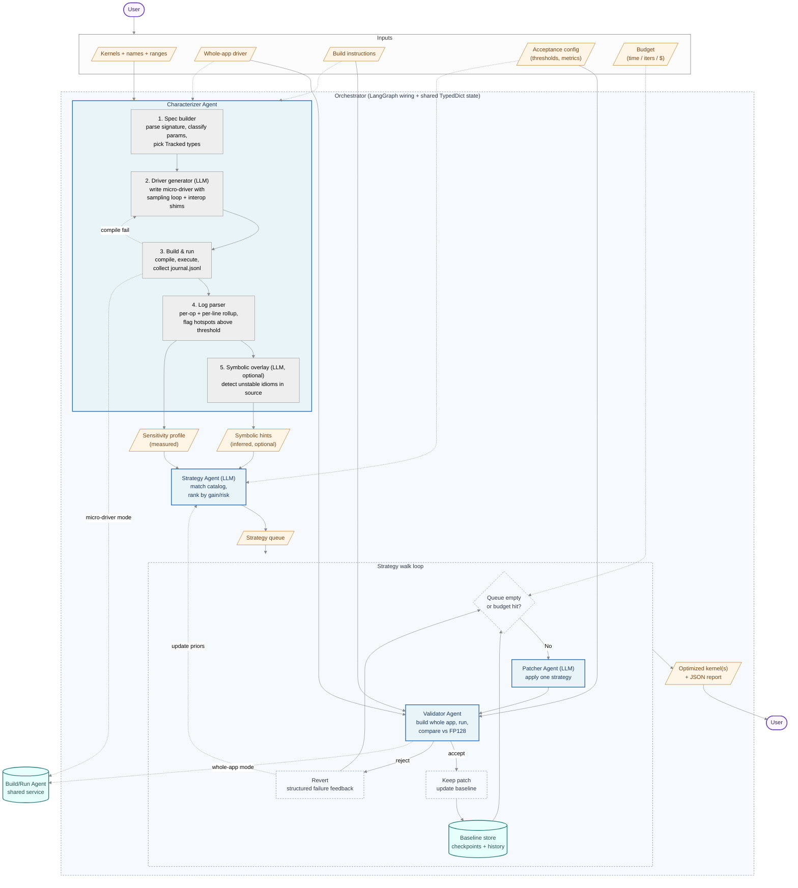

# Agentic Mixed-Precision Demo

An LLM-driven multi-agent pipeline that finds safe mixed-precision optimizations in C++ scientific computing kernels. Given one or more kernels, per-argument input ranges, a whole-application driver, and build instructions, the pipeline characterizes numerical sensitivity, picks fixes from a fixed catalog, applies them one at a time, and validates each against an FP128 reference.

The `langgraph-agents` branch implements **v2** of the system: a LangGraph orchestrator coordinating six pieces — characterizer, strategy, patcher, validator, build/run (shared), and the orchestrator itself — built around a sibling `Tracked<T>` C++ library that records per-operation condition numbers and accumulated error.

---

## v2 pipeline


```mermaid
%%{init: {'theme':'neutral', 'flowchart':{'curve':'basis'}, 'themeVariables':{'lineColor':'#888'}}}%%
flowchart TB
    U([User])

    subgraph INPUTS[Inputs]
        direction LR
        K[/"Kernels + names + ranges"/]
        D[/"Whole-app driver"/]
        B[/"Build instructions"/]
        F[/"Acceptance config<br/>(thresholds, metrics)"/]
        BUD[/"Budget<br/>(time / iters / $)"/]
    end

    U --> INPUTS

    subgraph ORCH["Orchestrator (LangGraph wiring + shared TypedDict state)"]
        direction TB

        subgraph CHAR[Characterizer Agent]
            direction TB
            CH1["1. Spec builder<br/>parse signature, classify params,<br/>pick Tracked types"]
            CH1 --> CH2["2. Driver generator (LLM)<br/>write micro-driver with<br/>sampling loop + interop shims"]
            CH2 --> CH3["3. Build &amp; run<br/>compile, execute,<br/>collect journal.jsonl"]
            CH3 -. compile fail .-> CH2
            CH3 --> CH4["4. Log parser<br/>per-op + per-line rollup,<br/>flag hotspots above threshold"]
            CH4 --> CH5["5. Symbolic overlay (LLM, optional)<br/>detect unstable idioms in source"]
        end

        CH4 --> PROF[/"Sensitivity profile<br/>(measured)"/]
        CH5 --> HINTS[/"Symbolic hints<br/>(inferred, optional)"/]
        PROF --> STRAT["Strategy Agent (LLM)<br/>match catalog,<br/>rank by gain/risk"]
        HINTS --> STRAT
        STRAT --> QUEUE[/"Strategy queue"/]

        subgraph WALK["Strategy walk loop"]
            direction TB
            LOOP{Queue empty<br/>or budget hit?}
            LOOP -->|No| PATCH["Patcher Agent (LLM)<br/>apply one strategy"]
            PATCH --> VAL["Validator Agent<br/>build whole app, run,<br/>compare vs FP128"]
            VAL -->|accept| KEEP["Keep patch<br/>update baseline"]
            VAL -->|reject| FB["Revert<br/>structured failure feedback"]
            KEEP --> STATE[("Baseline store<br/>checkpoints + history")]
            STATE --> LOOP
            FB --> LOOP
        end

        QUEUE --> WALK
        FB -. update priors .-> STRAT
        WALK --> OUT[/"Optimized kernel(s)<br/>+ JSON report"/]
    end

    K --> CHAR
    D -.-> CHAR
    B -.-> CHAR
    D --> VAL
    B --> VAL
    F --> VAL
    F -.-> STRAT
    BUD -.-> LOOP

    BR[("Build/Run Agent<br/>shared service")]
    CH3 -. micro-driver mode .-> BR
    VAL -. whole-app mode .-> BR

    OUT --> Z([User])

    classDef agent fill:#e8f4f8,stroke:#2b6cb0,stroke-width:2px,color:#1a365d
    classDef plumbing fill:#f7fafc,stroke:#718096,stroke-width:1px,stroke-dasharray:4 3,color:#2d3748
    classDef io fill:#fef5e7,stroke:#b7791f,stroke-width:1px,color:#744210
    classDef shared fill:#e6fffa,stroke:#2c7a7b,stroke-width:2px,color:#234e52
    classDef actor fill:#faf5ff,stroke:#6b46c1,stroke-width:2px,color:#322659
    class CHAR,STRAT,PATCH,VAL agent
    class ORCH,WALK,LOOP,KEEP,FB plumbing
    class K,D,B,F,BUD,PROF,HINTS,QUEUE,OUT io
    class BR,STATE shared
    class U,Z actor
```

**Reading the diagram:**

- Solid arrows = required data flow. Dotted arrows = optional / feedback / service calls.
- Boxes tagged `(LLM)` make Anthropic API calls; everything else is deterministic Python.
- The orchestrator and strategy-walk loop are LangGraph plumbing — no LLM, just routing and state.
- The Characterizer emits two artifacts: the **sensitivity profile** (measured, always present) and **symbolic hints** (inferred via the optional LLM overlay). Both feed the Strategy Agent independently.
- The **Baseline store** holds the accumulated patched source across iterations — each accepted patch updates it, the next strategy is tested on top.
- Rejection feedback flows two ways: into the loop (so the queue advances) and back to the Strategy Agent (so subsequent rankings update their priors).
- The Build/Run Agent is a shared service called by both the characterizer (micro-driver mode) and the validator (whole-app mode), not a pipeline stage.

---

## Inputs

The pipeline takes seven things from the user:

| Input | Used by | Purpose |
|-------|---------|---------|
| Kernel source files | Characterizer | The C++ to instrument and analyze |
| Kernel function names | Characterizer | Which functions inside the source to target |
| Per-argument input ranges | Characterizer | Sampling intervals for each kernel argument |
| Whole-app driver | Validator (primary), Characterizer (reference) | The real program that calls the kernels — used by the validator to test patches end-to-end and (lighter touch, planned) by the characterizer to mimic the real call convention |
| Build instructions | Validator (primary), Characterizer (env extraction, planned) | cmake/script that builds the whole app — source of include paths, defs, link libs, flags |
| Acceptance config | Validator, Strategy (ranking) | Metric (`min` / `p99` / `median` / `two-tier`), minimum digits, early-stop policy. Also informs Strategy's gain/risk ranking. |
| Budget | Strategy walk loop | Time, iteration, and/or cost ceiling that stops the walk loop independent of queue exhaustion. Default: 50 iterations. |

---

## Components

### 1. Characterizer Agent

Builds a per-kernel sensitivity profile by instrumenting the kernel with `Tracked<T>`, running it on randomly sampled inputs, and rolling up the per-operation telemetry. Five internal steps:

1. **Spec builder** (pure Python) — parses the kernel signature, classifies each parameter as input / output / inout, picks Tracked instantiation types (real scalar or complex).
2. **Driver generator** (LLM) — Claude writes a self-contained micro-driver that includes the kernel verbatim, wraps inputs with `tracked::track()`, calls the kernel in a sampling loop, and flushes a journal. Handles interop shims, opaque wraps, and inline reimplementations for non-templatable framework math.
3. **Build & run** — calls the shared Build/Run agent in micro-driver mode. On configure or build failure, feeds the error back to the driver generator (multi-turn `tool_result`) and retries up to `--max-driver-attempts`.
4. **Log parser** — reads the JSONL journal, aggregates per-op and per-line, flags ops above the condition-number threshold. Emits `sensitivity_profile.json` (always present) plus `interop_decisions.json` and per-attempt artifacts under `attempts/` with a `retry_log.json` summary.
5. **Symbolic overlay** (LLM, optional, best-effort) — separate Claude call that inspects the kernel source for known unstable idioms (catastrophic cancellation, naive variance, log-sum-exp, large-magnitude sum, division by near-zero). Emits `symbolic_hints.json`. Never gates the pipeline.

The sensitivity profile (measured) and symbolic hints (inferred, optional) are surfaced as two independent inputs to the Strategy Agent rather than a single merged artifact.

### 2. Strategy Agent (LLM)

Reads the sensitivity profile (and any symbolic hints), matches hotspots against a fixed catalog of optimizations, ranks the matches by expected gain and risk, and emits a queue of strategy attempts. The catalog is closed-set in v1 — the agent picks from a menu, doesn't invent novel transformations.

| Strategy | Patch shape | Risk |
|---|---|---|
| Downcast (`double` → `float`) | Type swap | Low |
| Float-float emulation (DD recovery) | Type swap | Low |
| FMA insertion | Line rewrite | Low |
| Algebraic rewrite (cancellation avoidance) | Line rewrite | Medium |
| Horner's method | Line rewrite | Medium |
| log-sum-exp rewrite | Multi-line | High |
| Kahan / compensated summation | Multi-line | Medium |
| Reassociation / pairwise summation | Multi-line | Medium |

Each catalog entry declares its preconditions, patch shape, risk, and expected gain. On validator rejection, structured failure feedback (failing inputs, digits achieved vs required, per-variable error delta) flows back so later proposals are informed by what already failed.

### 3. Patcher Agent (LLM)

Applies one strategy at a time to the current kernel baseline. Three patch shapes supported:

- Type swaps (one-line)
- Single-line rewrites
- Templated multi-line transformations (Kahan, log-sum-exp, etc.)

No free-form function-level rewrites in v1. The patcher does not run anything and does not judge anything — it only produces a new version of the source.

### 4. Validator Agent

Takes the patched source, invokes the shared Build/Run agent in **whole-app mode** (the user's real driver + build script, not a synthesized micro-driver), and compares the output against an FP128 reference. Comparison is deterministic — `scripts/compare_results.py` computes per-sample matching significant decimal digits.

Acceptance metric is configurable: `min` / `p99` / `median` / `two-tier`. Default: **p99 ≥ 10 digits**. Regardless of which metric gates acceptance, the full distribution (min, p1, p50, p99, max) is reported. On failure, sends a structured failure report back to the strategy agent.

### 5. Build/Run Agent (shared service)

Owns compilation, framework detection, include paths, link libraries, module loads, and execution. Two modes:

- **Micro-driver mode** — called by the characterizer. The agent is given a generated `.cpp` plus an instrumentation spec; it renders a `CMakeLists.txt`, configures, builds, runs, and returns a `RunResult` with an explicit `phase` field (`configure` / `build` / `run` / `ok`) and the journal path if the run succeeded.
- **Whole-app mode** — called by the validator. The agent runs the user's real build script against the patched source tree.

Today it is a deterministic subprocess wrapper. Planned: LLM-driven framework detection, smarter error recovery, automatic module loading. Sharing one agent across both call sites means a single source of truth for build environment and (when smarts land) a single prompt to maintain.

### 6. Orchestrator (LangGraph wiring + shared TypedDict state)

Top-level LangGraph graph. Holds the shared `PipelineState` TypedDict, routes data between agents, owns the strategy-walk loop (queue management, accept/revert bookkeeping, budget tracking, stop conditions). No LLM — predictable plumbing by design. Loop semantics:

- **Sequential layering** — each accepted patch becomes the new baseline in the **Baseline store**; the next strategy is tested on top of the accumulated state. The store also holds per-iteration checkpoints so a walk can be inspected or resumed.
- **No combining strategies in v1** — one at a time, validate, keep or revert.
- **Re-characterization between accepted patches deferred** — characterize once at the start, walk the queue.
- **Rejection feedback is two-way** — a structured failure report advances the loop (so the next queued strategy runs) *and* flows back to the Strategy Agent so subsequent rankings update their priors on what has already failed.

Stop conditions: queue exhausted, budget hit (iteration / time / cost; default 50 iterations), or optional early-stop after K consecutive failures.

---

## What's implemented vs stubbed today

Status on `langgraph-agents` as of this README:

| Component | Status |
|---|---|
| Characterizer — spec builder, driver-gen, log parser, symbolic overlay, retry loop | **Implemented** |
| Build/Run agent — micro-driver mode (deterministic subprocess wrapper) | **Implemented** |
| Build/Run agent — whole-app mode | Not yet wired |
| Build/Run agent — LLM-driven framework detection / env extraction | Planned (`PLAN_build_env.md` upcoming) |
| Strategy agent | Stub (returns identity, empty queue) |
| Patcher agent | Stub |
| Validator agent | Stub |
| Orchestrator | Wires characterizer end-to-end; downstream stages are pass-through |

The characterizer's vertical slice is end-to-end functional: six calibration fixtures (cancellation, cancellation_out, naive_variance, log_sum_exp, kahan, cLn, Lnrat) run and produce sensitivity profiles that flag the expected hotspots. Historical slice-level plans live under `agents/characterizer/archive/` (see its `README.md` for what was implemented). The next-stage design for whole-app characterization (Range Discovery agent + tiered dependency/body profiling, with locked implementation contracts) is in [`PLAN_implementation.md`](PLAN_implementation.md).

---

## Prerequisites

- Python 3.12. Install deps: `pip install -r requirements-langgraph.txt`
- Tracked library: vendored as a git subtree at `third_party/tracked/` (source: `ReetBarik/Tracked-Error-Propagation-Datatype-Demo@main`). A plain clone includes it — no submodule init required. Upstream sync: `git subtree pull --prefix=third_party/tracked https://github.com/ReetBarik/Tracked-Error-Propagation-Datatype-Demo.git main --squash`
- CMake ≥ 3.18 on PATH
- For Kokkos-backed kernels: a Serial-only Kokkos install. The Tracked repo ships `examples/cln_micro/build_kokkos_serial.sh` to produce one at `$HOME/kokkos-install`
- Argo proxy running (same `run-argo.sh` from the v1 workflow); the characterizer's `driver_gen` and `symbolic_overlay` nodes hit it for Claude Opus 4.7

---

## Running the characterizer slice

Single fixture end-to-end:

```bash
python -m agents.cli characterize \
  --kernel tests/agents/fixtures/kernels/cancellation.cpp \
  --kernel-name cancellation_check \
  --ranges-yaml tests/agents/fixtures/input_ranges/cancellation.yaml \
  --samples 512 \
  --max-driver-attempts 5 \
  --out runs/cancellation
```

Artifacts land in `runs/cancellation/`:

- `src/micro_driver.cpp` — winning (or last-tried) driver
- `CMakeLists.txt` — rendered build script
- `interop_decisions.json` — per-call strategy choices (shim / opaque / inline)
- `journal.jsonl` — raw Tracked output
- `sensitivity_profile.json` — characterizer's roll-up
- `symbolic_hints.json` — LLM idiom detection (best-effort)
- `attempts/` — per-retry driver source, stderr log, phase, returncode
- `retry_log.json` — at-a-glance summary of the compile-retry sequence

All calibration fixtures:

```bash
for k in cancellation naive_variance log_sum_exp kahan; do
  python -m agents.cli characterize \
    --kernel tests/agents/fixtures/kernels/${k}.cpp \
    --kernel-name $(python -c "print({'cancellation':'cancellation_check','naive_variance':'naive_variance','log_sum_exp':'log_sum_exp_naive','kahan':'kahan_sum'}['$k'])") \
    --ranges-yaml tests/agents/fixtures/input_ranges/${k}.yaml \
    --samples 512 \
    --out runs/${k}
done
```

Each profile's `top_hotspots` (sorted by max condition number) should flag the predicted hotspot for that kernel.

Kokkos kernel (Serial backend):

```bash
python -m agents.cli characterize \
  --kernel tests/agents/fixtures/kernels/cln_kernel.hpp \
  --kernel-name cLn \
  --ranges-yaml tests/agents/fixtures/input_ranges/cln_kernel.yaml \
  --samples 256 \
  --kokkos-root $HOME/kokkos-install \
  --out runs/cln
```

The characterizer detects the Kokkos framework from the source, picks per-call strategies for `Kokkos::log` / `Kokkos::abs` (interop shim, opaque wrap, or — preferred — decomposed real-valued tracked ops), and propagates provenance through the boundary.

### Tests

```bash
pytest tests/agents/test_log_parser.py
pytest tests/agents/test_driver_retry_loop.py
```

Pure-unit tests today: log parser (13 cases) and the retry-loop control flow / tool_use_id threading / role classification. End-to-end and driver-gen snapshot tests are deferred — see `agents/characterizer/archive/NEXT.md` §3.

---

## Repository layout

```
.
├── agents/                              # v2 multi-agent pipeline
│   ├── cli.py                           # entry point: `python -m agents.cli characterize ...`
│   ├── config.py                        # PipelineConfig + env defaults
│   ├── orchestrator.py                  # LangGraph wiring
│   ├── state.py                         # PipelineState TypedDict
│   ├── build_run/                       # shared build/run service
│   │   ├── agent.py                     # deterministic subprocess wrapper
│   │   └── cmake_template.cmake         # micro-driver build template
│   ├── characterizer/                   # characterizer agent
│   │   ├── agent.py                     # 6-step pipeline + retry loop
│   │   ├── driver_gen.py                # LLM micro-driver generation
│   │   ├── log_parser.py                # journal.jsonl → SensitivityProfile
│   │   ├── symbolic_overlay.py          # optional idiom detection
│   │   ├── spec.py                      # InstrumentationSpec dataclass
│   │   ├── profile.py                   # SensitivityProfile, OpRecord, etc.
│   │   ├── prompts/                     # driver_gen.txt, symbolic_overlay.txt
│   │   └── archive/                      # historical slice plans (see archive/README.md)
│   ├── strategy/                        # stub
│   ├── patcher/                         # stub
│   └── validator/                       # stub
├── tests/agents/                        # fixtures + unit tests
├── runs/                                # committed run artifacts (intentional;
│                                        # lets remote-cluster runs be shared
│                                        # with assistants that don't have SSH)
├── third_party/tracked/                 # sibling Tracked<T> library (submodule)
├── src/                                 # example kernels (kokkosUtils.h)
├── scripts/                             # compare_results.py, build env helpers
├── requirements-langgraph.txt           # v2 deps
├── PLAN_overview.md                     # high-level architecture plan
└── PLAN_implementation.md               # active extension: whole-app characterization + locked contracts
```

---

## Deferred to a future cut

- Whole-app mode in the Build/Run agent and a real Validator agent
- Whole-app driver + build script consumption by the characterizer (lighter-touch env extraction; design in `PLAN_build_env.md` upcoming)
- Strategy combining (independence-class grouping using Tracked dataflow)
- Re-characterization between accepted patches
- Model-per-role assignment (cheap models for mechanical work, Opus for reasoning)
- Free-form function-level rewrites
- LLM-driven framework detection and module loading in Build/Run
