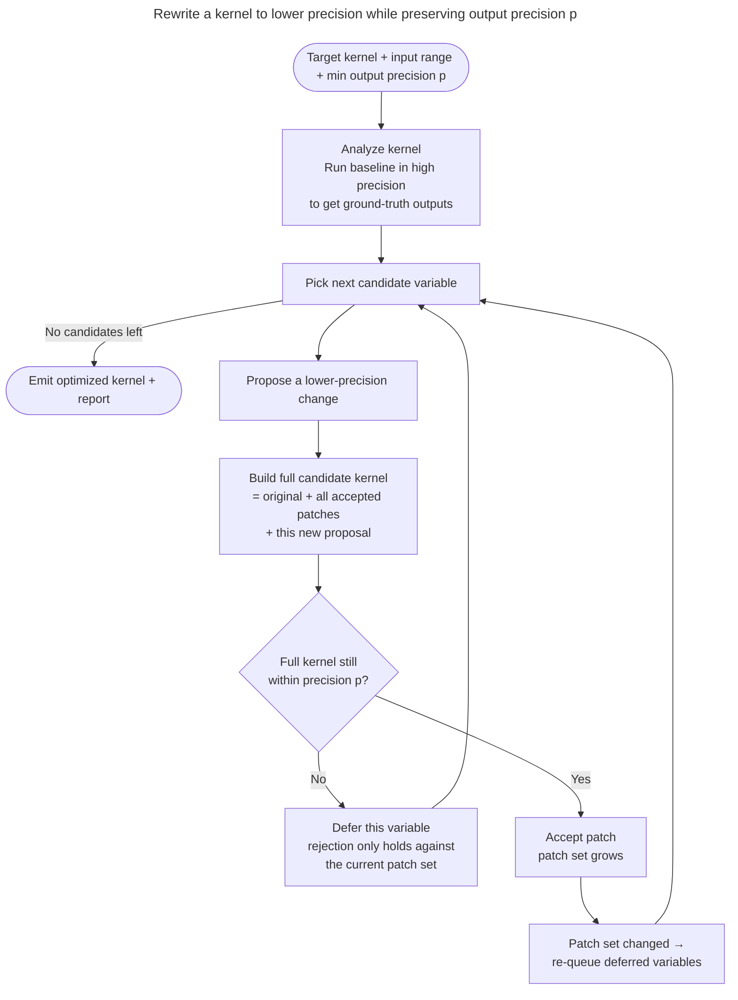

```mermaid
---
title: Rewrite a kernel to lower precision while preserving output precision p
---
flowchart TD
    Start([Target kernel + input range + min output precision p])
    Start --> Setup[Analyze kernel\nRun baseline in high precision\nto get ground-truth outputs]
    Setup --> Pick

    Pick[Pick next candidate variable]
    Pick -- No candidates left --> Done([Emit optimized kernel + report])
    Pick --> Propose[Propose a lower-precision change]
    Propose --> Build[Build full candidate kernel\n= original + all accepted patches\n+ this new proposal]
    Build --> Verify{Full kernel still\nwithin precision p?}
    Verify -- No --> Defer[Defer this variable\nrejection only holds against\nthe current patch set]
    Defer --> Pick
    Verify -- Yes --> Accept[Accept patch\npatch set grows]
    Accept --> Reopen[Patch set changed →\nre-queue deferred variables]
    Reopen --> Pick
```

> See `mermaid.md` for the detailed view (proposer skills, compile loop, HPC/DB, adversarial sampling, cost measurement).
