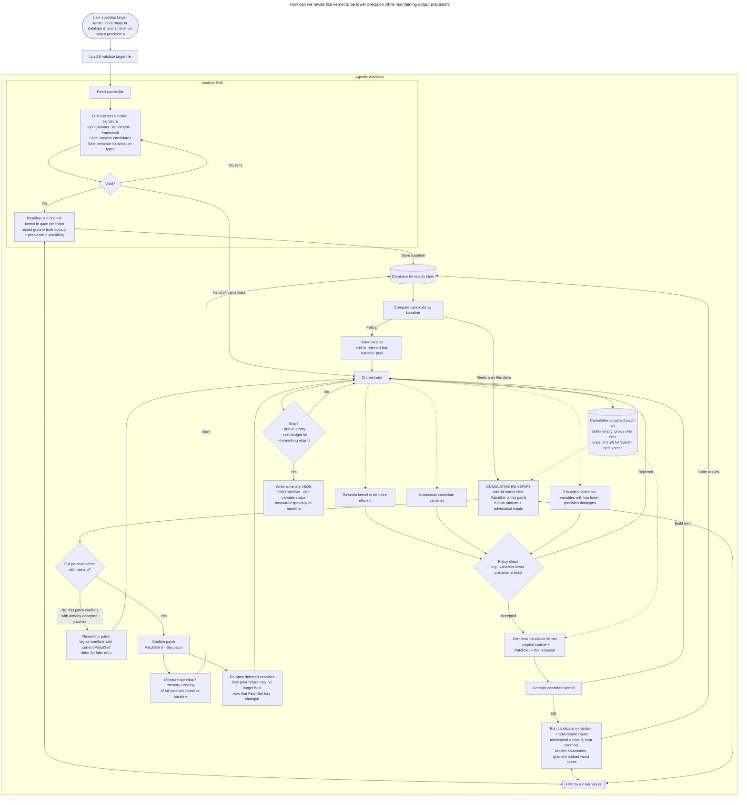

```mermaid
---
title: How can we rewite this kernel to be lower precision while maintaining output precision?
---
flowchart TD
    User([User specifies target kernel, input range in datatype d, and a minimum\noutput precision p])
    User --> Loader[Load & validate target file]
    Loader --> Reader

    DB[(Database for results store)]
    HPC[[HPC to run kernels on]]

    subgraph Agentic Workflow

        subgraph AnalyzeSkill["Analyze Skill"]
            Reader[Read source file]
            Reader --> Analyze[LLM extracts function signature\nInput params · return type · framework\nLocal variable candidates\nSafe template instantiation types]
            Analyze --> Validator{Valid?}
            Validator -- No, retry --> Analyze
            Validator -- Yes --> Baseline
            Baseline[Baseline: run original kernel in quad precision\nrecord ground-truth outputs + per-variable sensitivity]
        end
        Baseline <--> HPC
        Baseline -- Store baseline --> DB

        %% Orchestrator + the cumulative patch set it owns
        A1[Orchestrator]
        PatchSet[(Cumulative accepted patch set\nstarts empty; grows over time\norigin of truth for 'current best kernel')]
        Validator -- Hand off candidates --> A1
        A1 <--> PatchSet

        %% Proposer skills (siblings, not a pipeline)
        A1 -..-> A3[Rewrites kernel to be more efficient]
        A1 -..-> A4[Downcasts candidate variables]
        A1 -..-> A5[Emulates candidate variables with two lower precision datatypes]

        Policy{Policy check\ne.g., variables lower precision at least}
        A3 --> Policy
        A4 --> Policy
        A5 --> Policy
        Policy -- Rejected --> A1

        %% Candidate kernel = baseline source + PatchSet so far + this new proposal
        Policy -- Accepted --> Compose[Compose candidate kernel\n= original source + PatchSet + this proposal]
        PatchSet -.-> Compose
        Compose --> A6[Compile candidate kernel]
        A6 -- Build error --> A1
        A6 -- OK --> A7[Run candidate on random + adversarial inputs\nadversarial = near 0, near overflow,\nbranch boundaries, gradient-probed worst cases]
        A7 <--> HPC
        A7 -- Store results --> DB

        %% First gate: this single delta must hold on its own
        DB --> A8[Compare candidate vs baseline]
        A8 -- Fails p --> Defer[Defer variable\nadd to 'rejected-but-retriable' pool]
        Defer --> A1

        %% Second gate (the key step): the FULL patched kernel must still hold.
        %% A patch that passes in isolation can still break the kernel when
        %% combined with previously accepted patches (errors don't compose linearly).
        A8 -- Meets p on this delta --> CumVerify[CUMULATIVE RE-VERIFY\nrebuild kernel with PatchSet ∪ this patch\nrun on random + adversarial inputs]
        PatchSet -.-> CumVerify
        CumVerify <--> HPC
        CumVerify --> CumCheck{Full patched kernel\nstill meets p?}
        CumCheck -- No: this patch conflicts\nwith already-accepted patches --> Conflict[Revert this patch\ntag as 'conflicts with current PatchSet'\ndefer for later retry]
        Conflict --> A1

        CumCheck -- Yes --> Confirm[Confirm patch\nPatchSet ∪= this patch]
        Confirm --> Cost[Measure speedup / memory / energy\nof full patched kernel vs baseline]
        Cost -- Store --> DB

        %% PatchSet just changed, so previously deferred variables may now succeed
        %% (a rejection only held against the OLD PatchSet).
        Confirm --> Requeue[Re-open deferred variables\ntheir prior failure may no longer hold\nnow that PatchSet has changed]
        Requeue --> A1

        %% Termination
        A1 --> Stop{Stop?\n- queue empty\n- cost budget hit\n- diminishing returns}
        Stop -- No --> A1
        Stop -- Yes --> A10[Write summary JSON\nfinal PatchSet · per-variable status\nmeasured speedup vs baseline]
    end
```
