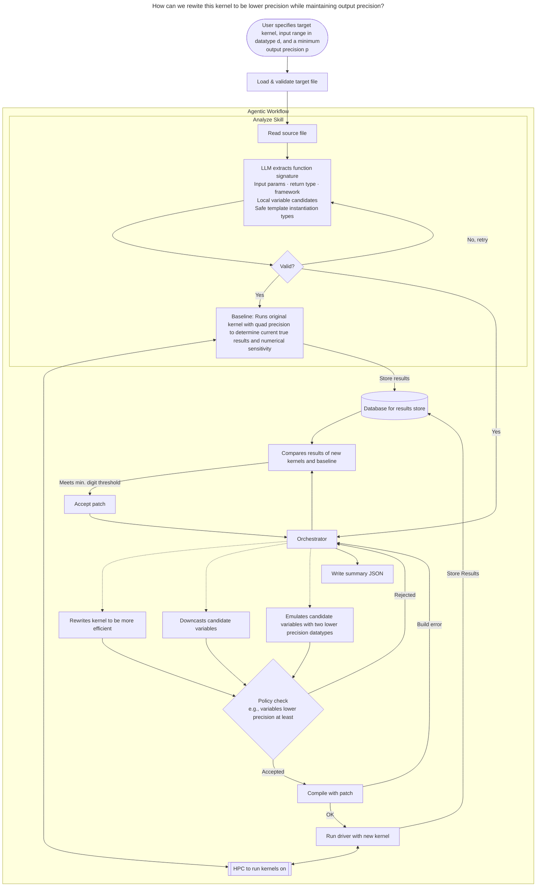

```mermaid
---
title: How can we rewite this kernel to be lower precision while maintaining output precision?
---
flowchart TD
    User([User specifies target kernel, input range in datatype d, and a minimum\noutput precision p]) 
    User --> Loader[Load & validate target file]
    Loader --> Reader

    DB[(Database for results store)]
    HPC[[HPC to run kernels on]]

    subgraph Agentic Workflow


        subgraph AnalyzeSkill["Analyze Skill"]
            Reader[Read source file]
            Reader --> Analyze[LLM extracts function signature\nInput params · return type · framework\nLocal variable candidates\nSafe template instantiation types]
            Analyze --> Validator{Valid?}
            Validator -- No, retry --> Analyze
            Validator -- Yes --> Baseline
            Baseline[Baseline: Runs original kernel with quad precision to determine current true results and numerical sensitivity]
        end
        Baseline <--> HPC
        Baseline -- Store results --> DB

        A1[Orchestrator]
        Validator -- Yes --> A1
        A1 -..-> A3[Rewrites kernel to be more efficient]
        A1 -..-> A4[Downcasts candidate variables]
        A1 -..-> A5[Emulates candidate variables with two lower precision datatypes]
        
        Policy{Policy check\ne.g., variables lower precision at least}
        A3 --> Policy
        A4 --> Policy
        A5 --> Policy
        Policy -- Rejected --> A1
        Policy -- Accepted --> A6[Compile with patch]
        A6 -- Build error --> A1
        A6 -- OK --> A7[Run driver with new kernel]
        A7 <--> HPC
        A7 -- Store Results --> DB

        A1 --> A8[Compares results of new kernels and baseline]
        DB --> A8
        A8 -- Meets min. digit threshold --> A9[Accept patch]
        A9 --> A1

        A1 --> A10[Write summary JSON]

    end


```
