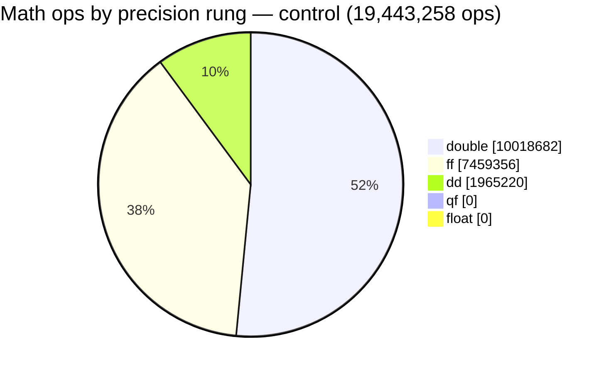

# QF (quad-float, 4×FP32) integrated as a precision rung between `double` and `dd`

**Date:** 2026-08-13 · **Branch:** `langgraph-agents` · **Tolerance:** 7.0 · **Samples:** 5000, seed 12345

## Verdict

**QF absorbs the entire dd set. `dd` goes from 2 integrals to 0.**

Both dd-routed integrals — **B12** and **B16** — clear the bar at qf and route there
instead, and nothing else moves. In a controlled A/B where the *only* difference is
whether the qf rung exists, that is the complete effect:

| | float | ff | double | qf | dd |
|---|---|---|---|---|---|
| control (`dd`-only correctness walk) | 0 | 14 | 5 | 0 | **2** |
| **qf run** (`qf`→`dd` walk) | 0 | 14 | 5 | **2** | **0** |

The raw count is small, and that is the honest headline — but it is the *wrong* headline
on its own. **The dd set is not an arbitrary 2 of 21; it is exactly the set of integrals
the pipeline could not serve any other way.** Every other integral is already handled by
a rung cheaper than double. B12 and B16 are the two that force the most expensive rung on
the ladder, and on fp32-heavy GPU silicon a double-double is the single most expensive
thing this pipeline can emit. So the move is 2/21 of the integrals and 100% of the
dd-tier cost. After this change **the routing contains no dd at all**.

The margin is comfortable, not marginal: qf clears the 7.0 bar by ~8.8 digits on both.

No build failures. No STOP conditions. Test baseline held (see Verification).

---

## Controlled routing diff

Three runs are compared. All are `tu_only`, tol 7.0, 5000 samples, seed 12345.

| run | id | correctness walk |
|---|---|---|
| reference (published baseline) | `20260813_053248_3c0ffa83` | `dd` |
| **control** | `20260813_185708_0d26ef7e` | `dd` |
| **qf run** | `20260813_185337_237840a2` | `qf` → `dd` |

The control exists because the reference run is **not** a valid comparison point — see
"Two effects, separated" below. Control and qf run were built fresh in their own
`--tu-out-dir` and produce **bit-identical baseline digits on all 21 integrals**, so the
qf rung is the only variable between them.

`A` = accepted, `r` = rejected below tolerance, `n` = `no_flip_needed` (raw double already
clears), `—` = not attempted.

| integral | base | ff | qf | dd (control) | ref | control | **qf run** |
|---|---|---|---|---|---|---|---|
| B1 | 12.1585 | 9.2642A | — | — | `ff` | `ff` | **`ff`** |
| B2 | 12.1421 | 10.0454A | — | — | `ff` | `ff` | **`ff`** |
| B3 | 11.9853 | 9.5024A | — | — | `ff` | `ff` | **`ff`** |
| B4 | 10.2498 | 8.4233A | — | — | `ff` | `ff` | **`ff`** |
| B5 | 11.5853 | 9.0449A | — | — | `ff` | `ff` | **`ff`** |
| B6 | 11.7706 | 10.1049A | — | — | `ff` | `ff` | **`ff`** |
| B7 | 11.6247 | 10.1825A | — | — | `ff` | `ff` | **`ff`** |
| B8 | 10.1387 | 8.5928A | — | — | `ff` | `ff` | **`ff`** |
| B9 | 11.5301 | 8.6415A | — | — | `ff` | `ff` | **`ff`** |
| B10 | 9.8781 | 7.8914A | — | — | `ff` | `ff` | **`ff`** |
| B11 | 9.4601 | 7.7693A | — | — | `ff` | `ff` | **`ff`** |
| **B12** | 3.6906 | 2.4065r | **15.8072A** | 15.9559A | `dd` | `dd` | **`qf`** |
| B13 | 8.5777 | 7.2692A | — | — | `ff` | `ff` | **`ff`** |
| B14 | 13.1855 | 10.8214A | — | — | `ff` | `ff` | **`ff`** |
| B15 | 12.0087 | 10.1771A | — | — | `dd` | `ff` | **`ff`** |
| **B16** | 6.5693 | 5.0989r | **15.8083A** | 15.9565A | `dd` | `dd` | **`qf`** |
| BIN0 | 12.1904 | — | — | — | `double` | `double` | **`double`** |
| BIN1 | 8.0947 | — | — | — | `double` | `double` | **`double`** |
| BIN2 | 9.1220 | — | — | — | `double` | `double` | **`double`** |
| BIN3 | 8.9081 | — | — | — | `ff` | `double` | **`double`** |
| BIN4 | 9.5803 | — | — | — | `double` | `double` | **`double`** |

**qf vs control: `{B12: dd→qf, B16: dd→qf}`. Nothing else differs.**

### Which dd-routed integrals moved to qf

Both of them.

| integral | baseline | qf candidate | dd candidate | qf − dd | qf lift | routed |
|---|---|---|---|---|---|---|
| B12 | 3.6906 | 15.8072 | 15.9559 | **−0.1487** | +12.1166 | `qf` |
| B16 | 6.5693 | 15.8083 | 15.9565 | **−0.1482** | +9.2390 | `qf` |

qf lands ~0.15 digits below dd on both — and that gap is *not* qf's ~2-digit precision
deficit showing through. **Both rungs are saturating the printer, not the arithmetic.**
The flip driver narrows its result to the caller's `double` at the app-output boundary
(`_printer_struct`, STOP #TT), so no candidate can score above double's ~15.95-digit
floor no matter how wide it computed internally. dd sits essentially *on* that floor
(15.956); qf sits a sixth of a digit under it. Both are ~8.8 digits clear of the 7.0 bar,
so the ordering between them is decorative — what matters is that qf is sufficient and
cheaper.

This also means **the run does not measure QF's ~29 digits**. It measures "is qf enough to
deliver a correct double to the caller", which is the question the pipeline actually asks.

---

## Op share by precision

The routing table counts *integrals*; this counts the **math operations** behind them.
Because `tu_only` flips a whole TU, every op in an integral executes at that integral's
routed precision, so op counts map onto rungs without ambiguity.

**After — the qf run:**

**Before — the control (identical run, qf rung absent):**

| rung | ops | control | **qf run** |
|---|---:|---:|---:|
| `float` | 0 | 0.00% | **0.00%** |
| `ff` | 7,459,356 | 38.36% | **38.36%** |
| `double` | 10,018,682 | 51.53% | **51.53%** |
| `qf` | 1,965,220 | 0.00% | **10.11%** |
| `dd` | 1,965,220 → 0 | 10.11% | **0.00%** |
| **total** | **19,443,258** | 100% | 100% |

**The entire 10.11% dd slice moves to qf, intact.** Nothing else shifts by a single op —
the same two integrals (B12, B16) carry it, so the two pies differ in exactly one label.
That is the op-level statement of the verdict: **10.1% of this workload's arithmetic was
running on the most expensive rung the pipeline can emit, and none of it is now.**

Op mix across all 21 integrals: `mul` 7,458,181 · `add` 4,260,392 · `sub` 3,866,267 ·
`div` 1,346,656 · `neg` 1,089,505 · `sqrt` 431,766 · `log` 388,742 · `abs` 377,587 ·
`atan2` 224,162.

### What these percentages are, and are not

Four caveats, because the number is easy to over-read:

1. **Counts are op *executions*, not cost.** A pie slice is "how many operations", not "how
   much silicon time". One qf op is ~4 FP32 ops of work and one dd op ~2 FP64 ops, so the
   *cost* share of the moved slice is not 10.11% at either end — this chart deliberately
   does not claim a speedup. It says where the arithmetic runs, which is what was asked.
2. **Every integral is weighted equally** — 1000 characterization samples each
   (`samples_seen` is uniform across all 21). So this is the op mix of a workload that
   exercises all 21 integrals equally, **not** of any real physics run, where call
   frequencies differ by orders of magnitude. Re-weighting by a real workload's integral
   histogram would move these percentages substantially.
3. **Source is the characterization run** (`runs/qcdloop/report_smoke.json`, 1000
   samples/integral), not the 5000-sample validation run that produced the digits. Op mix
   is a structural property of the code paths taken, so the two agree in shape, but the
   absolute counts belong to the characterization draw.
4. **Instrumented regions only.** Ops are summed over the regions the reducer localized
   (35–102 per integral); arithmetic outside an instrumented region is not in the total.

---

## Two effects, separated

The naive diff (reference → qf run) shows four integrals moving. Only two are QF's doing.
The other two come from causes that also appear in the qf-free control, and conflating
them would overstate the result:

| integral | move | cause |
|---|---|---|
| B12 | `dd` → `qf` | **QF** |
| B16 | `dd` → `qf` | **QF** |
| B15 | `dd` → `ff` | stale binary in the reference run (below) |
| BIN3 | `ff` → `double` | the fp32-family range guard (T5, below) |

### B15 — the reference run measured against a stale vanilla binary

`runs/qcdloop/tu_e2e_out/van_build/boxGPU_app` is dated **2026-07-30 00:30**, but the
reference run executed **2026-08-13 05:32**. `runner.build_driver` runs `cmake --build`,
which is incremental, and `shutil.copytree` preserves mtimes — so the cloned snapshot
looked no newer than the July-30 objects and the vanilla driver **was never relinked**.
The reference run's baseline digits therefore came from a pre-header-refresh binary.

Rebuilt fresh, the vanilla driver differs from that stale one on 51,088 / 105,000 `RES`
lines, agreeing to only **10.3 digits relative to the sample scale** — ill-conditioned
double arithmetic is genuinely sensitive to code-gen (FMA contraction, reassociation).
That is enough to resolve B15's and BIN0's documented analytic-zero artifact: their
baselines move `0.0000 → 12.0087` and `0.0000 → 12.1904`, so B15 no longer needs a
correctness flip at all.

**This is not caused by anything in this change**, and it is not caused by the one edit
made to a measured input (`boxGPU_app_recipes.hpp`, below). Proof: a vanilla driver built
with that edit reverted is **bit-identical to the fresh vanilla on all 105,000 lines**
(0 differing), and differs from the reference's stale binary on the same 51,088. The
control arm — which contains no qf at all — reproduces B15 → `ff` exactly.

> **Consequence for the record:** the `HEADER_REFRESH_2026-08-13` conclusion
> ("routing bit-identical, 0/42 digit pairs drifted") rests on a vanilla binary that
> predates the refresh it was validating. Its *oracle*-side checks are unaffected, but the
> baseline column of that report should be re-measured before it is relied on again. Not
> actioned here — flagging it.

### BIN3 — the range guard, firing correctly

See T5 below. BIN3 is range-unsafe and was being routed to `ff` on measured digits alone.

---

## Range-guard rejections

**All five BIN integrals are fp32-range-unsafe**; every B* integral is safe.

| integral | localizable regions | range-unsafe regions | TU verdict |
|---|---|---|---|
| B1–B16 | 35–78 each | **0** | safe |
| BIN0 | 57 | 20 | **unsafe** |
| BIN1 | 53 | 17 | **unsafe** |
| BIN2 | 55 | 17 | **unsafe** |
| BIN3 | 71 | 1 | **unsafe** |
| BIN4 | 94 | 26 | **unsafe** |

Telemetry: `integrals_skipped_range_unsafe: 10` = 5 integrals × 2 skipped speedup rungs
(`float`, `ff`). **Zero qf-rung skips**: all five BIN integrals already clear the bar at
raw double (`no_flip_needed`), so the correctness walk never reached the qf rung for them.
The correctness-side guard is therefore wired and tested but did not fire on this workload.

One routing consequence: **BIN3 `ff` → `double`**. BIN3 carries one range-unsafe region
and was previously admitted to `ff` purely on its measured 7.487 digits. The accuracy
signal (`predicted_rel_err_if_*`) cannot substitute for a range verdict — it does not
model over/underflow at all — and the Validator's finite 5000-sample draw can miss an
overflow that a wider input would hit. BIN0/1/2/4 were already at `double`, so the guard
changes nothing for them.

---

## What was built

### T1 — headers vendored

`qf_math.hpp` + `qf_complex.hpp` copied **verbatim** (md5-verified) from
`kokkos-extended-precision-demo@e67d7da`. A standalone TU including both compiles clean at
`-std=c++20` against `~/kokkos-install` with **zero patches**.

Provenance caveat recorded in `UPSTREAM.sha`: the dd/ff `source_sha` `5ae2f80` **no longer
resolves upstream** (history was rewritten). It is kept verbatim rather than silently
repointed; dd/ff content was re-verified against upstream HEAD and differs by exactly the
recorded local-patch set. Only the two QF files were copied — dd/ff were not re-vendored.

### T1b — QF local patches, driven by real compile errors

The standalone TU needed nothing. The **real** per-group flip TU needed four patches, each
a twin of an existing dd/ff patch and each traceable to a specific failing source site:

| patch | evidence |
|---|---|
| unary `operator+()` | `B2m.h` `TOutput(+p3sq + m3sq - m4sq)` — *no match for `operator+`* |
| `operator int()` | `B3m.h` `ir14 = <QuadFloat expr>` where `ir14` is `int` — *cannot convert* |
| `QuadFloat(int)` ctor | `B3m.h` / `B4m.h` `ql::Imag(r13) == 0` — *conversion from `int` is ambiguous* |
| 6 scalar-`float` comparisons | **coupled** to `operator int()` — see below |

The comparison overloads are not independently motivated: pristine QF resolves `qf == 0.0`
fine, but adding `operator int()` makes it ambiguous (both directions become user-defined
conversions). The `float` overloads win by standard conversion and break the tie. This is
the same coupling `UPSTREAM.sha` already warns about for dd/ff — **the two must be applied
or dropped together**. `float` and not `double` overloads, because QuadFloat has both
converting ctors and declaring both families would reintroduce the ambiguity.

Two dd/ff patches were **not** needed and deliberately not added: unary `operator+()` on
`QuadFloatComplex` (no call site appeared) and the hypot-style overflow-safe complex
`abs()`. The latter is worth a note — `qf_complex.hpp` ships the **naive**
`sqrt(re²+im²)`, which overflows at `sqrt(FLT_MAX) ≈ 1.84e19` and is exactly the STOP
#HHH/#III bug that produced `ff = nan` on half the BIN inputs. QF has the identical FP32
ceiling, so this is latent, not absent. It did not fire here because the two qf-routed
integrals (B12, B16) are range-safe and the range-unsafe BIN integrals never reach qf.
**If a range-unsafe integral is ever routed to qf, apply the hypot twin first.**

All five box groups build and run at qf: `runs/qcdloop/qf_flip_probe.py`.

### T2 — `ql::qfun` + `kokkosMaths_qf.h`

A real namespace (not an alias — an alias cannot host the using-declarations), mirroring
`kokkosMaths_ff.h` structurally: `qfloat`, `qfcomplex`, `make_qf` → `QuadFloat::from_bits`
(four limbs), `qf_pi()` → `QuadFloat_pi()`. QF is in the same position ff was at STOP #EEE
and clears it the same way — on the vendored `QuadFloatComplex`, not `Kokkos::complex<QuadFloat>`.

The 43 Chebyshev + 25 Bernoulli coefficient tables are generated by
`scripts/one_off/gen_qf_constants.py` from the **exact dd source pair** (`hi + lo`, ~31
digits), not from its double rounding. This matters for QF and did not for ff: QF resolves
~29 digits, so a double-sourced split would have capped the tables ~13 digits below what
the type can hold. The generator uses exact `Fraction` arithmetic with a hand-written
round-to-nearest-even FP32 rounder (a Python `float` intermediate would double-round the
residual). Validated two ways: **0 mismatches against `struct` on 200,000 random doubles**
plus a subnormal sweep, and it **reproduces all six of upstream's `QuadFloat_*` constants
bit-for-bit**.

> **Range, not precision, is the floor in the table tails.** QF widens the significand but
> inherits FP32's exponent range, so entries near the denormal floor cannot spend their low
> limbs: `B[24]` (~4.8e-42) is itself subnormal and reconstructs to ~5 digits; `C[42]`
> (~−1.1e-35) to ~10. QF buys nothing over ff there. Harmless in context — those terms sit
> 35+ orders below `C[0]`/`B[0]` — but it is the same FP32 ceiling the range guard exists
> for, visible in the constants rather than the data.

### T3 — stack wiring

`TargetPrecision.QF`; `PROFILES[QF]` (`USE_QF_COMPLEX`, `kokkosMaths_qf.h`, `QFPrinter`);
instantiation-gate vocabulary extended to `QuadFloat`/`QuadFloatComplex` and their
`ql::qfun` aliases (the four SHAPE_* tags keep their dd-flavoured names — the defect shapes
are precision-independent, only the vocabulary was dd-specific).

### T6 — ladder and walk

`LADDER = ("float", "ff", "double", "qf", "dd")`; four new transition kinds
(`double-to-qf`, `qf-to-dd`, `dd-to-qf`, `qf-to-double`). `double-to-dd` / `dd-to-double`
were **retained** — inserting a rung must not silently retire the direct transition, which
the walk still emits whenever qf is skipped or rejected.

`tu_walk.CORRECTNESS_WALK = ("qf", "dd")`, first accept wins. Walking qf-first is also why
**STOP #ZZ needs no relaxation**: there is never a dd accept to undo, because qf is
evaluated before dd is ever attempted.

The documented final-routing tie-break is now *cheapest* accepted, not *widest* — as
written it would have preferred dd over qf if both were ever recorded, inverting the point
of the rung. (The walk short-circuits, so only one is recorded in practice; the rule is
stated correctly so it stays correct if that changes.)

---

## Findings that required a decision

### 1. `PrecisionProfile.two_limb` means "exactly two limbs named `.hi`/`.lo`" — and it breaks QF

**Audited as requested.** The flag does **not** mean "multi-limb aggregate". Every consumer
(`dispatch.py`, `fanout.py`, `chain_promote.py`, `regional.py`) forwards it into
`boundary.*`, and all of those funnel into one primitive that emits a literal
`static_cast<T>(e.hi) + static_cast<T>(e.lo)`.

For QF **both** branches are wrong: `two_limb=True` emits `.hi`/`.lo`, which `QuadFloat`
does not have; `two_limb=False` emits a plain cast, and `QuadFloat` has no `operator
double`. So this did "actually break QF", which is the condition under which the task
authorised a change. The minimal fix keeps the flag's meaning ("is an extended aggregate")
and adds a `limbs` tuple saying *which* members it has — `("hi","lo")` for dd/ff, `()` for
native float, `("f0","f1","f2","f3")` for qf. Narrowing stays a single shared primitive
(STOP #TT). **dd/ff/float driver text is byte-identical** — regression-tested.

`dispatch.py` / `fanout.py` themselves needed no change: no qf intent can reach them
(next finding).

### 2. A silent downcast the qf rung exposed in `dispatch.py`

`_gen_regional` mapped its target with `{"ff":…, "dd":…}.get(to, "float")`. That default
was safe only while `float` was the sole other rung. With qf on the shared ladder, a
`double-to-qf` intent would have been silently serviced as a **float downcast** — an
upcast turned into a precision *loss*, with no error and nothing in the build to catch it.

Fixed two ways: Strategy no longer emits such intents (`models.REGION_REALIZABLE` — the
region path has float/ff/dd integrators and no qf one, so the region walk excludes qf in
both directions, including the newly-reachable `dd → qf` demotion), and `dispatch`
now fails loud instead of defaulting. The ladder stays single and honest: qf is on it
because it is a real precision; one *mechanism* cannot reach it yet.

### 3. The transport premise — candidates emit one narrowed double, not `hi|lo`

The task specified that the QF printer sum four limbs into a `hi|lo` pair. **Reported
rather than implemented as literally worded**, because the premise does not match the code:
the flip drivers do not emit `hi|lo`. Only the **DD oracle** does. Every *candidate* —
dd, ff, float, and now qf — emits a **single** `dhex` token narrowed to the caller's
`double`. This is deliberate (`_printer_struct`: the caller contract is double, so the
measured lift is the honest caller-precision accuracy, capped at ~15.9), and the existing
dd driver on disk confirms it: `dhex(static_cast<double>(v.hi) + static_cast<double>(v.lo))`.

Making qf alone emit `hi|lo` would have scored it at ~29 digits while dd scored ~15.9 —
qf would then "win" every comparison for reasons of instrumentation rather than numerics,
and the number would no longer mean "accuracy delivered to the caller".

So the QF printer **sums all four limbs** — `f0 + f1 + f2 + f3`, never truncating to `f0`,
which is the substance of the requirement — into one caller-precision double, identically
to how dd sums `hi + lo`. If the intent really was to widen the transport, that is a
change to *all* rungs' printers plus the scorer, not a qf-only one, and should be a
separate task.

### 4. The `float_ok = False → ["ff"]` fallback was never range-safe

Confirmed as predicted. **The predicate is about the value's own magnitude at both ends** —
`abs_val_min >= FLT_MIN_NORMAL and abs_val_max <= FLT_MAX` — so it is an **overflow ceiling
AND a normal-range underflow floor**, not low-limb underflow. It is a property of FP32's
*exponent range*, which is not float-specific at all: `float` (1×FP32), `ff` (2×FP32) and
`qf` (4×FP32) all inherit it. Dropping float and falling back to ff moved to a rung the
same measurement disqualifies.

Now keyed on `models.FP32_FAMILY` and applied in **both directions and both walks**: the
region speedup walk, the region correctness walk, the tu_only correctness walk (skipping
qf), and the tu_only speedup walk. That last one had **no range guard at all** — it
consulted only the accuracy signal — which is what was routing BIN3 to `ff`. Fail-open
default preserved; `ZERO_REF_TOL` and `ref_scale` untouched.

What it still does **not** model is low-limb underflow: a value comfortably inside FP32
range whose 3rd/4th limbs fall under `FLT_MIN_NORMAL` and flush to zero, costing precision
rather than range. That is real (the constant tails above show it) and now documented at
the predicate, but it is unmeasured — the reducer emits no per-limb signal. Left as-is.

### 5. One measured input was edited

`runs/qcdloop/src/boxGPU_app_recipes.hpp` — its `to_d` helper hard-coded `.hi`, so a QF TU
would not compile. Now branches on **layout** (a C++20 `requires` probe) rather than naming
a type, and sums all four QF words (one FP32 word cannot hold the source double). The
two-limb branch still returns `.hi` alone, unchanged, so dd/ff `INP` fingerprints are
byte-identical. **Proven numerically inert**: vanilla built with the edit reverted is
bit-identical to vanilla built with it, on all 105,000 `RES` lines.

---

## Verification

| check | result |
|---|---|
| standalone TU, both QF headers, `-std=c++20` | pass, **zero patches** |
| `kokkosMaths_qf.h` `ql::` surface instantiates | pass — constants, `kAbs/kLog/kSqrt/kConj`, `Sign/Max/Min/Htheta`, `Real/Imag`, `kPow`, `iszero` |
| QF numerics spot-check | `abs(3+4i)=5`, `log(3+4i).re=ln 5`, `sqrt(3+4i)=2+i`, `(3+4i)³=−117+44i` |
| constant generator vs IEEE rounding | **0 / 200,000** mismatches + subnormal sweep |
| constant generator vs upstream's six constants | **6 / 6 bit-identical** |
| per-group QF flip TU build + run | **5 / 5 groups** |
| dd/ff/float driver text after the `limbs` change | byte-identical |
| recipes edit numerically inert | **105,000 / 105,000** lines identical |
| control vs qf-run baselines | identical on all 21 integrals |
| qf run reproducibility | two runs, identical routing and digits |
| pytest | see below |

**Test baseline.** Baseline at `HEAD` (`e67d7cf`) collects **984** (983 passed + the known
real-LLM flake). This branch collects **1002**, and the confirming run was **1002 passed /
0 failed** — the flake did not fire.

The delta is **+18 net**: **23 test functions added** (QF profile/printer/limbs, qf-first
correctness walk, qf build-failure fallthrough, range-guard on both phases and both
directions, region-path qf exclusion), of which **5 replace renamed predecessors** listed
below, so they add coverage without adding to the count. Counted against `HEAD`:
984 + 23 − 5 = 1002.

> An earlier draft of this section read "1006 passed / 1 failed — 23 tests added". That
> double-counted the five renames and assumed the flake would fire. Corrected against a
> `git worktree` collection at `HEAD` (984) versus this tree (1002).

The known real-LLM flake is nondeterministic and picks a different test in the
`test_real_llm_*` family per run
(`test_real_llm_previously_failing_region_has_clean_includes[B2m.h:65]` at baseline,
`test_real_llm_ieps50_derived_not_r4` on one intermediate run, none at the end). All 10
`test_real_llm_*` tests passed in the confirming run. Not chased, per the task.

Seven pre-existing tests were updated, all deliberately. The first five are the renames
counted above (old name removed, new name added); the last two are in-place assertion
edits that keep their names:

* `test_wi1_range_unsafe_stops_at_ff` → `..._stays_at_double` — the corrected behavior.
  Its `precision_distribution` assertion moved `ff: 1` → `double: 1, ff: 0` in the same
  edit; that is part of this rename, not a separate test.
* three `float_ok=` walk tests → `fp32_range_ok=`, with the ff fallback removed.
* `test_profiles_declare_all_three_targets` → `..._every_ladder_target`.
* two `precision_distribution` equality assertions (`test_e2e`, `test_loop`) gained the
  `qf: 0` key — renamed nothing, so they do not appear in the ±5 above.

## Non-goals honoured

No QD oracle. No `ZERO_REF_TOL` / `ref_scale` change. No change to `~/qcdloop` or
`ddfun_enabled`. No LICENSE/NOTICE bookkeeping for QF's LBNL-BSD lineage (deferred, and
noted in `UPSTREAM.sha` — the vendored headers reference a `LICENSES/` text this repo does
not carry). No renames under `runs/archive/**` or `tier_b_stage2_*`. No Strategy ranking or
gate refactor.

## Artifacts

| what | where |
|---|---|
| qf run | `runs/qcdloop/strategy/20260813_185337_237840a2/` |
| control run | `runs/qcdloop/strategy/20260813_185708_0d26ef7e/` |
| run logs | `runs/qcdloop/qf_integration_run.log`, `qf_control_run.log` |
| build/measure scratch | `runs/qcdloop/qf_tu_e2e_out/`, `qf_control_out/` |
| per-group QF build probe | `runs/qcdloop/qf_flip_probe.py`, `qf_probe_out/` |
| constant generator | `scripts/one_off/gen_qf_constants.py` (`--check` re-reports table error) |
| provenance + local patches | `third_party/include/UPSTREAM.sha` |
| op-share source data | `runs/qcdloop/report_smoke.json` — per-region `ops` counters, summed per integral and grouped by each run's `tu_routing` |
